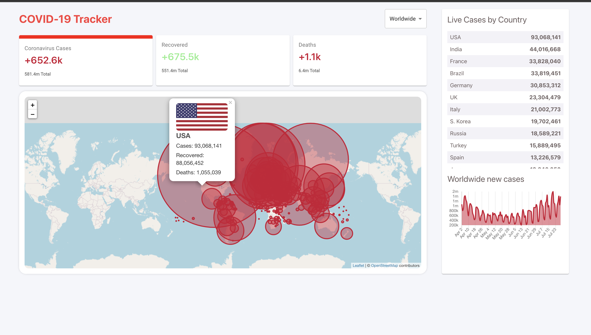

# Covid-19 Tracker
## Table of contents
* [Summary](#summary)
* [Technology](#technologies)
* [Visit Website](#visit-website)
* [Contact](#contact)

Welcome to Covid-19 Tracker. 

 

<kbd>

</kbd>

## Summary
Tracking Covid-19 cases around the world using disease.sh - Open Disease Data API

## Technologies

### Tools 
* Html
* Css
* Javascript
* leaflet
* numeral
* react-bootstrap
* react-icons
* react-chartjs-2
* react-scripts
* material-ui
* react hooks

## Visit Website
http://covid19-reactjs.s3-website.us-east-2.amazonaws.com/

## Contact
Created by [Pau Thawn](https://www.linkedin.com/in/pau-thawn) 
Feel free to contact me for any questions! 

